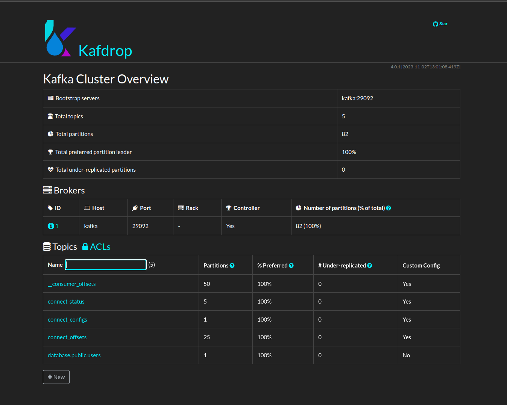
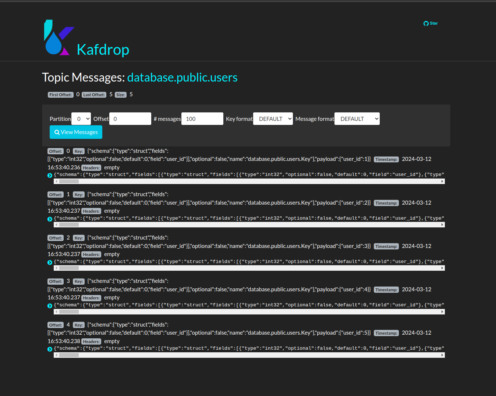

# Postgresql Debezium CDC Setup


## Setup
To start all the services like postgres, kafka, zookeeper, kafdrop, and connect, run the following command.
```shell
make start
```

## Register the user connector
```shell
curl -X POST -H "Accept:application/json" -H "Content-Type:application/json" localhost:8083/connectors/ -d '
{
    "name": "users-connector",
    "config": {
        "connector.class": "io.debezium.connector.postgresql.PostgresConnector",
        "topic.prefix": "database",
        "database.hostname": "database",
        "database.port": "5432",
        "database.user": "warlock",
        "database.password": "warlock",
        "database.dbname": "warlock",
        "database.server.name": "database",
        "table.include.list": "public.users",
        "plugin.name": "pgoutput",
        "database.history.kafka.bootstrap.servers": "kafka:9092"
    }
}'
```

## Insert some data into the users table
```sql
INSERT INTO users (username, email, password)
VALUES
    ('user1', 'user1@example.com', 'password1'),
    ('user2', 'user2@example.com', 'password2'),
    ('user3', 'user3@example.com', 'password3'),
    ('user4', 'user4@example.com', 'password4'),
    ('user5', 'user5@example.com', 'password5');
```

## Check the kafdrop dashboard
You can see the new topic `database.public.users` in kafdrop dashboard.


## Check the messages in the topic


## Stop all the services
```shell
make stop
```
